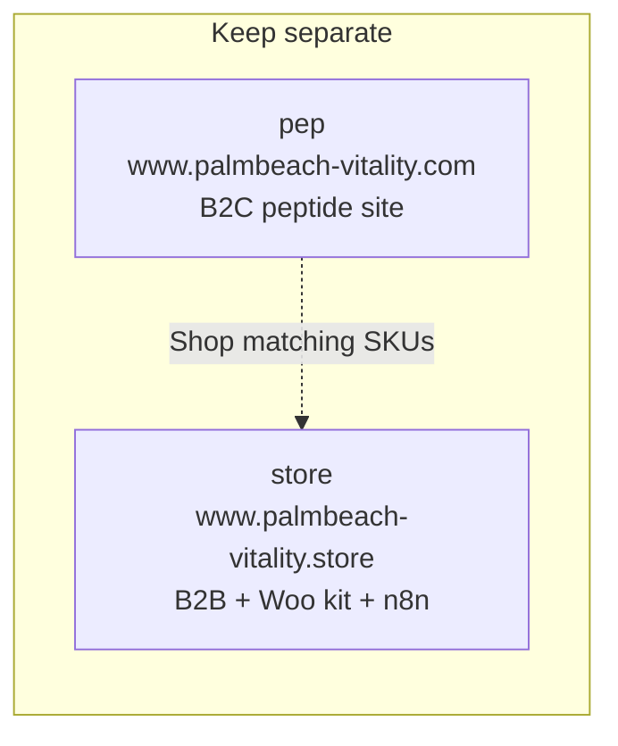

# Palm Beach Vitality (Store)

**New to this work? Read [`HANDOVER.md`](HANDOVER.md) first.** Current state of the vid-gen
workflows and sheets, the PR stack, how to write to a live Google Sheet, the compound selector
footgun, open decisions waiting on Salvatore, and the mistakes already made.

A fully static, multi-page website (HTML + Tailwind CSS via CDN + a little vanilla JS) for the `www.palmbeach-vitality.store` domain, plus a **Shopify → WooCommerce migration kit** under `woocommerce-migration/`.

## Marketing / n8n (Reel Studio)

**#1 priority — image and video quality.** Always. Quality beats speed, cost, habit, and “the last model we used.” Do not ship a still or clip that is softer than the brief (measure pixels; a sheet cell that says `2k` or `1080p` is not proof). Soft first frames make soft I2V. Pick the model per shot, not per convenience. Canonical quality playbook + surveyed API opinions: `marketing/vid-gen-quality-playbook.md`.

**Social delivery is 9:16 only.** Reels / Stories / TikTok. Stills and clips are vertical. **1080p here means 1080 × 1920**, never landscape 1920 × 1080. Do not recommend or generate 16:9 for studio video.

**`still_edit_instructions` is a fluid node.** In every vid-gen workflow it is a scratch pad Salvatore types over per run, and it sits off the live path (`save_still_url` → `skip_still_edit`). Ignore any prompt you find in it — it is not a lock, not a hardcode, and not a defect to report. Only the **wire** matters: if `save_still_url` feeds `still_edit_instructions` instead of `skip_still_edit`, the edit desk is live and burning an API call per run, and that is worth raising.

**Audio is off. Always.** All three vid-gen workflows — `Vid_gen_lab_scenes`, `Vid_gen_landscape_scenes`, `peptide_pen_vid_gen`. This is the one generation value the nodes are allowed to hardcode, and Salvatore has asked for it explicitly, so do **not** re-wire it to the sheet's `audio` column. Each prep node forces `audio: false` / `generate_audio: false` **and** prefixes the sheet `video_motion_prompt` with `Silent video. No soundtrack, no music, no sound effects, no dialogue, no ambient audio.` — the API flag on its own has let a clip come back scored. Add sound in post, never at generation.
**HARD RULE — prompt review gate:** Before **every** still, video, or edit generation (Flux, Grok, Kling, Seedance, Veo, Runway, Sonilo, n8n overlay+gen, retries, one-offs), send Salvatore the **exact** prompt or edit text in the Cursor window (no copy/paste boxes) and wait for his OK. **Before every video run, send the n8n workflow name + ID, the API + model, the still URL if I2V, duration / resolution / aspect, and the exact motion prompt, then wait for approve or deny.** Only two sentences authorize a start — **"you may run the workflow"** or **"you can start the workflow"** — everything else, including `ok`, `go`, `its fine`, and present-tense reports like "running the smoke test", is a denial. Default to a partial run that stops at `save_still_url` so Salvatore can check and pin the still himself. Do not overlay-and-execute in the same turn as the ask. A rewrite after a block is a new ask. No exceptions. Skill: `.cursor/skills/prompt-review-gate/SKILL.md`. Human copy: `marketing/prompt-review-gate.md`.

**Main goal:** daily **45–60s** reel = **Grok** unique lab-item footage (+ smooth extend) + **Creatomate** text overlays. Subjects = 500 lab items only. Canonical: `marketing/GOAL.md` + `marketing/n8n-45s-reel-grok-creatomate.md`.

**Prompt wording:** before any still/video overlay, apply `.cursor/skills/prompt-moderation-hygiene/SKILL.md` so Flux/Kling/Grok/Seedance/Veo do not false-positive on crash/interceptor/fire/needle language. Human copy: `marketing/prompt-moderation-rulebook.md`.

**Humans in video — mandatory, no exceptions:** any time you write, rewrite, overlay, or execute a still or video generation whose frame contains a person (astronaut, face, hands, wrist, body, model, presenter), you MUST first read `.cursor/skills/prompt-moderation-hygiene/SKILL.md` and `references/human-subjects.md`, run the pre-flight gate in `SKILL.md` (look at the still, provider ↔ face rule, legal duration, lexicon scan, `references/incidents.md` repeat check), and state in your reply that the gate ran and what it decided. Do this even for a "quick" run, a re-run, a single-row test, or when Salvatore says the prompt is already fine. Never execute a face-forward human row on Veo. After the run, append the result to `references/incidents.md`. A human vid gen run without the gate is a mistake regardless of whether it passed.

## Cursor Cloud specific instructions

### Scope (do not cross)
- **This agent / this repo is ONLY for `www.palmbeach-vitality.store`** (`PalmBeach-Vitality/store`), including the WooCommerce theme under `woocommerce-migration/`.
- **Do NOT edit, push to, or deploy `www.palmbeach-vitality.com`.** That site lives in a separate repo (`PalmBeach-Vitality/pep`) and is handled by a different agent.
- If a request is clearly for vitality.com / the `pep` repo, refuse and tell the user to use the .com agent instead. Do not apply .com product-landing or marketing-page work here by mistake.

### Repo map
`store` and `pep` stay **separate**. They look similar. They are two sites, two domains, two agents.

- The public site files are **pure static HTML**. There is no build step, no package manager, no `package.json`, and no dependencies to install for those pages. Tailwind is loaded from a CDN at runtime.
- There are **no lint, test, or build commands**. Do not look for them.
- Pages live in per-route folders as `index.html` (e.g. `products/index.html`, `contact/index.html`) plus article pages under `research/`.
- To preview the static site: `python3 -m http.server 8000` from this directory, then browse `http://localhost:8000/`.
- Interactive behavior is plain vanilla JS embedded in each page: the mobile menu toggle, the product category filter on `products/index.html` (filter buttons use `data-filter` matched against each card's `data-category`), and the dosage protocol calculator on `protocols/index.html` (peptide selection, reconstitution math, copy/print summary).
- Editing any `.html` file takes effect on a simple browser refresh — there is no hot-reload/watch process.
- **WooCommerce cannot run in this repo** (no PHP/MySQL). Migration artifacts live in `woocommerce-migration/` (plan, CSV, redirects, WordPress theme). Regenerate the product CSV with `python3 woocommerce-migration/scripts/build-woocommerce-csv.py`.
- **Repo + Sheet together:** Whenever you change a Google Sheet row (prompts, picks, edit copy, times_used, take_urls), update the matching repo CSV / docs in the **same turn** and write the live sheet in that same turn. Never leave a lock in the repo only, and never write the live sheet without committing the repo mirror. Do not ask Sal to “push” a sheet write — just do both.
- **CSV updates:** Whenever you create, update, or regenerate any `.csv` file, always include a clickable GitHub link to each changed file in your reply to the user (after commit/push). Use the blob URL for the current branch, e.g. `https://github.com/PalmBeach-Vitality/store/blob/<branch>/<path-to-file.csv>`.
- **n8n node instructions:** Whenever you give parameters for an n8n node to add or edit, always show the wire position first as `Before → **This node** → After` (use `end` / `unwired` when needed). Do this every time, not only on the first node in a sequence.
- **No hardcoding unless Salvatore asks (n8n / Grok / sheets):** Do **not** hardcode prompts, prompt wrappers/locks, still-edit text, models, duration, aspect, resolution, `n`, wait seconds, cameras, motion, compound names, captions, CTA copy, temperature, max_tokens, or `|| '9:16'` / `|| 15` / `|| '1080p'` / `|| 'grok-imagine-video-1.5'` fallbacks. **Audio is the standing exception** — already asked for, hardcoded off everywhere (see above). Every generation input comes from Google Sheets (Get Rows / `pick_creation` / other sheet nodes). Nodes may only: (1) map sheet fields with expressions, (2) call APIs, (3) write results back to sheets. Empty sheet cell → throw, do not invent a fallback. Allowed without asking: runtime API URLs (`still_url`, `video_url`, `request_id`), sheet document/tab identity, filter values that match sheet vocabulary (`status=Active`), and xAI endpoint URLs. Hardcode a value **only** when Salvatore explicitly asks to hardcode that specific value. See `.cursor/rules/no-hardcode-unless-asked.mdc`.
- **Prompt review gate:** Do not execute still-gen, video-gen, I2V, extend, or image-edit until Salvatore has approved the exact prompt/edit text in chat. Before every video run, send workflow name + ID, API, model, still URL, duration, and the exact motion prompt, then wait for approve or deny. A start needs one of exactly two sentences — "you may run the workflow" or "you can start the workflow"; treat everything else as a denial. Stop at `save_still_url` by default and let him pin the still. See `.cursor/skills/prompt-review-gate/SKILL.md`.
