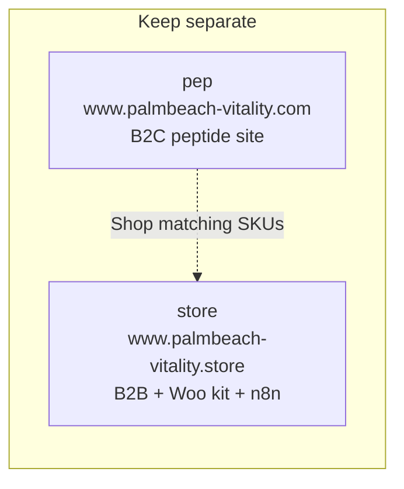

# Palm Beach Vitality (Store)

A fully static, multi-page website (HTML + Tailwind CSS via CDN + a little vanilla JS) for the `www.palmbeach-vitality.store` domain, plus a **Shopify → WooCommerce migration kit** under `woocommerce-migration/`.

## Marketing / n8n (Reel Studio)

**Main goal:** daily **45–60s** reel = **Grok** unique lab-item footage (+ smooth extend) + **Creatomate** text overlays. Subjects = 500 lab items only. Canonical: `marketing/GOAL.md` + `marketing/n8n-45s-reel-grok-creatomate.md`.

## Cursor Cloud specific instructions

### Scope (do not cross)
- **This agent / this repo is ONLY for `www.palmbeach-vitality.store`** (`PalmBeach-Vitality/store`), including the WooCommerce theme under `woocommerce-migration/`.
- **Do NOT edit, push to, or deploy `www.palmbeach-vitality.com`.** That site lives in a separate repo (`PalmBeach-Vitality/pep`) and is handled by a different agent.
- If a request is clearly for vitality.com / the `pep` repo, refuse and tell the user to use the .com agent instead. Do not apply .com product-landing or marketing-page work here by mistake.

### Repo map
`store` and `pep` stay **separate**. They look similar. They are two sites, two domains, two agents.

- The public site files are **pure static HTML**. There is no build step, no package manager, no `package.json`, and no dependencies to install for those pages. Tailwind is loaded from a CDN at runtime.
- There are **no lint, test, or build commands**. Do not look for them.
- Pages live in per-route folders as `index.html` (e.g. `products/index.html`, `contact/index.html`) plus article pages under `research/`.
- To preview the static site: `python3 -m http.server 8000` from this directory, then browse `http://localhost:8000/`.
- Interactive behavior is plain vanilla JS embedded in each page: the mobile menu toggle, the product category filter on `products/index.html` (filter buttons use `data-filter` matched against each card's `data-category`), and the dosage protocol calculator on `protocols/index.html` (peptide selection, reconstitution math, copy/print summary).
- Editing any `.html` file takes effect on a simple browser refresh — there is no hot-reload/watch process.
- **WooCommerce cannot run in this repo** (no PHP/MySQL). Migration artifacts live in `woocommerce-migration/` (plan, CSV, redirects, WordPress theme). Regenerate the product CSV with `python3 woocommerce-migration/scripts/build-woocommerce-csv.py`.
- **CSV updates:** Whenever you create, update, or regenerate any `.csv` file, always include a clickable GitHub link to each changed file in your reply to the user (after commit/push). Use the blob URL for the current branch, e.g. `https://github.com/PalmBeach-Vitality/store/blob/<branch>/<path-to-file.csv>`.
- **n8n node instructions:** Whenever you give parameters for an n8n node to add or edit, always show the wire position first as `Before → **This node** → After` (use `end` / `unwired` when needed). Do this every time, not only on the first node in a sequence.
- **No hardcoding unless Salvatore asks (n8n / Grok / sheets):** Do **not** hardcode prompts, prompt wrappers/locks, still-edit text, models, duration, aspect, resolution, `n`, audio, wait seconds, cameras, motion, compound names, captions, CTA copy, temperature, max_tokens, or `|| '9:16'` / `|| 15` / `|| '1080p'` / `|| 'grok-imagine-video-1.5'` fallbacks. Every generation input comes from Google Sheets (Get Rows / `pick_creation` / other sheet nodes). Nodes may only: (1) map sheet fields with expressions, (2) call APIs, (3) write results back to sheets. Empty sheet cell → throw, do not invent a fallback. Allowed without asking: runtime API URLs (`still_url`, `video_url`, `request_id`), sheet document/tab identity, filter values that match sheet vocabulary (`status=Active`), and xAI endpoint URLs. Hardcode a value **only** when Salvatore explicitly asks to hardcode that specific value. See `.cursor/rules/no-hardcode-unless-asked.mdc`.
